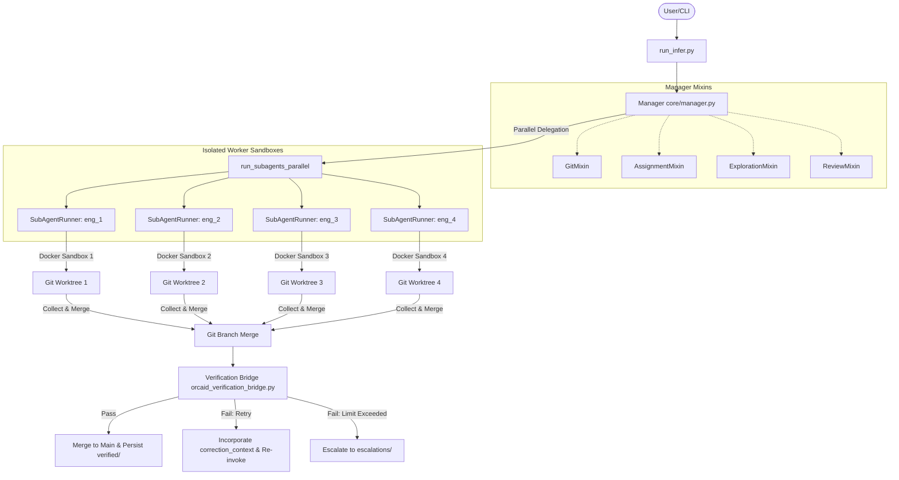

# Architecture

**Analysis Date:** 2026-05-18

This document describes the conceptual architecture, layers, data flows, and persistent state management models of OrCAID (Orchestrated Centralized Asynchronous Isolated Delegation).

---

## 1. Architectural Pattern Overview

OrCAID operates on a **Centralized Orchestrator with Isolated Workers** architectural pattern. 



### Key Architectural Characteristics
- **Isolated Execution:** Subagents cannot affect the main repository or each other during execution because each worker runs in a separate git worktree and independent Docker container.
- **Asynchronous Concurrency:** Communication is managed asynchronously via `asyncio`. Up to 4 engineers execute concurrently.
- **Centralized Synchronization:** A single manager handles initial requirements decomposition, task routing, worktree merging, and global outcome verification.
- **Self-Healing Loop:** Workers are evaluated by a dynamic verification bridge. Drifts and failures trigger automated closed-loop retries with model feedback instead of outright failure.

---

## 2. Conceptual Layers

OrCAID is organized into five conceptual layers:

### A. Entrypoint & Orchestration Layer
- **Files:** `run_infer.py`, `config.py`
- **Purpose:** Parse CLI arguments, parse configurations (`WorkflowConfig`), manage global workspace directories, coordinate high-level setup steps, and compile the final summary logs.
- **Depends on:** Core manager, task modules.

### B. Manager Coordination Layer
- **Files:** `core/manager.py`, `core/manager_assignment.py`, `core/manager_exploration.py`, `core/manager_git.py`, `core/manager_review.py`
- **Purpose:** Central coordinator. Uses a mixin-based structure to handle task routing, worktree branch creation, conflict handling, grading, and final synthesis.
- **Abstractions:** `Manager` inherits from all mixins to expose unified properties.
- **Depends on:** Git system, OpenHands SDK, task schemas, worker layer.

### C. Worker Sandbox Layer
- **Files:** `core/subagent.py`
- **Purpose:** Stateful execution engine for individual subagents. Sets up the subagent LLM, default tools, and local workspace before triggering the agent task loops.
- **Abstractions:** `SubAgentRunner` class.
- **Depends on:** OpenHands SDK, Git Worktrees.

### D. Task Domain Layer
- **Files:** `tasks/base.py`, `tasks/commit0.py`, `tasks/paperbench.py`, `tasks/self_improve.py`
- **Purpose:** Encapsulate benchmark-specific structures (Commit0 coding vs. Paperbench research reproduction). Defines task parsing, specific prompt mappings, and custom result schemas.
- **Depends on:** Hugging Face datasets.

### E. Verification & Closed-Loop Memory Layer
- **Files:** `orcaid_verification_bridge.py`
- **Purpose:** Acts as a gatekeeper during task completion. Compares subagent results (`SubAgentResult`) against target checklists, logs architectural drift, triggers closed-loop retries, and maintains persistent state directories.
- **Depends on:** PyYAML.

---

## 3. Core Data Flow Lifecycle

A full execution cycle follows these structured stages:

```
[Onboarding]
     │
     ▼
[Analysis & Decomposition] ──(ExplorationMixin: Backg. Explore)
     │
     ▼
[Delegation & Plan]
     │
     ▼
[Parallel Dispatching]
  ├─► eng_1 (worktree + docker sandbox) ─┐
  ├─► eng_2 (worktree + docker sandbox) ─┼─► [Collect Outcomes]
  ├─► eng_3 (worktree + docker sandbox) ─┤         │
  └─► eng_4 (worktree + docker sandbox) ─┘         ▼
                                             [Bridge Check]
                                                   ├─► PASS: Merge & Save
                                                   ├─► FAIL: Retry Context
                                                   └─► ESCALATE: Flag Ty
                                                           │
                                                           ▼
                                                     [Synthesis]
```

1. **Discovery & Onboarding:** Manager reads the task parameters and initializes the Docker workspace.
2. **Analysis & Decomposition:** The `Manager` calls the LLM with a detailed context template to produce a hierarchical decomposition of the task, outputted as a tree of `TaskNode` objects.
   - *Exploration Bonus:* For Commit0, a background thread runs static analyses (`ExplorationMixin`) to discover files and dependencies while the manager analyzes.
3. **Delegation Plan:** The manager evaluates the task tree and maps tasks into a dependency list (`DelegationPlan`), assigning profiles (Hermes profiles: Developer, Debugger, Researcher, Reviewer) and estimated complexities.
4. **Parallel Execution:** `run_subagents_parallel` instantiates `SubAgentRunner` instances for each leaf node. Workers run in parallel up to `max_subagents` concurrency limits.
5. **Collect & Merge:** When a worker finishes a round, the manager collects their changes:
   - Stages and commits worktree modifications.
   - Merges the worktree branch into the main repository branch.
   - Handles conflicts by either aborting and sending the conflict files back to the agent, or applying a forced override on later rounds.
6. **Closed-Loop Verification:** `_verify_and_return()` invokes the verification bridge. Verdict triggers a retry with correction feedback or archives the successful run.
7. **Synthesis:** After all subagents complete, the manager aggregates findings, triggers a final global review conversation (`final_review_all`), and writes structured logs.

---

## 4. State Management

- **Task-Level State:** Maintained inside `SubAgentResult` (26 tracked variables, including duration, tokens, cost, modified files, success flags).
- **Git-Level State:** Maintained via remote branches (`feature/{engineer_id}`) and local tracking.
- **Persistent Orchestration Memory:** Kept under `~/.hermes/orchestrator-memory/` to coordinate cron metrics, drift records, human-in-the-loop escalations, and gap indices.
